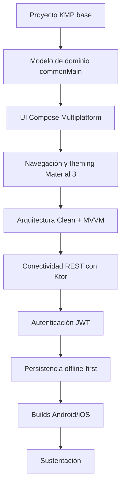

# Guía del Proyecto Sello de Desarrollo de Aplicaciones Móviles

## 1. Propósito

El Proyecto Sello integra las sesiones de **Desarrollo de Aplicaciones Móviles** alrededor de una misma aplicación multiplataforma que evoluciona hasta ejecutarse en Android e iOS. Cada sesión agrega una capacidad real construida sobre Kotlin Multiplatform y Compose Multiplatform, desde la estructura del proyecto hasta la conectividad, la persistencia offline-first y el build final firmado.

### Competencia o capacidad del proyecto

Al finalizar el Proyecto Sello, el estudiante demuestra que puede diseñar, implementar y defender una aplicación móvil multiplataforma end-to-end, aplicando Kotlin Multiplatform, Compose Multiplatform, arquitectura Clean + MVVM, conectividad REST, autenticación, persistencia local offline-first y generación de builds para Android e iOS.

### Competencias relacionadas

| Código | Competencia | Relación con el proyecto |
|---|---|---|
| CE023 | Programación | Evidencia el desarrollo de una aplicación móvil integrada con servicios digitales (CE0235), construida con Kotlin Multiplatform y Compose Multiplatform para Android e iOS. |
| CE022 | Ingeniería de la Información | Evidencia persistencia local multiplataforma, sincronización offline-first y manejo estructurado de datos consumidos vía REST. |
| CE024 | Calidad de Software | Evidencia autenticación, manejo de errores, pruebas unitarias, documentación, repositorio y sustentación integral. |

Fuente oficial de los códigos: [Transcripción de evidencias por competencia — Ingeniería de Software](https://upeuoficial.github.io/planb/transcripcion/#c-area-de-ingenieria-de-software).

```text
KMP base -> UI Compose -> Navegación y arquitectura Clean+MVVM -> Conectividad REST -> Autenticación -> Persistencia offline-first -> Builds Android/iOS -> Sustentación
```

## 2. El Proyecto

Durante el semestre desarrollarás una **aplicación móvil multiplataforma** construida con Kotlin Multiplatform y Compose Multiplatform, ejecutable en Android e iOS desde una base de código común en `commonMain`.

El proyecto debe partir de un dominio claro, con pantallas y flujos definidos en Compose Multiplatform, arquitectura Clean + MVVM, conectividad con servicios REST mediante Ktor, autenticación JWT, persistencia local offline-first con SQLDelight y builds firmados para ambas plataformas.

El proyecto debe cumplir estas condiciones:

- Modelar un dominio claro y compartido en `commonMain`.
- Construir UI declarativa con Compose Multiplatform, navegación y theming Material 3.
- Aplicar arquitectura Clean + MVVM con ViewModel multiplataforma, StateFlow/UiState, casos de uso y repositorios.
- Consumir servicios REST con Ktor Client, manejando estados de carga, éxito y error.
- Integrar autenticación JWT con almacenamiento seguro de tokens.
- Persistir datos localmente con SQLDelight bajo una estrategia offline-first con sincronización.
- Ejecutarse y validarse en Android e iOS, con evidencia real en ambas plataformas.
- Ser sustentado técnicamente por todos los integrantes del equipo.

No se considera Proyecto Sello:

- Pantallas de Compose sin arquitectura ni datos reales.
- Una aplicación que solo funcione en Android o solo en iOS sin justificación técnica.
- Un CRUD REST sin autenticación ni manejo de errores.
- Persistencia local sin estrategia de sincronización offline-first.
- Un proyecto que el estudiante no pueda ejecutar en ambas plataformas ni explicar en código.

## 3. Evolución del Proyecto

| Unidad | Temas principales | Evolución del proyecto |
|---|---|---|
| Unidad 1: Fundamentos de Kotlin Multiplatform y UI con Compose Multiplatform | Kotlin esencial, modelado del dominio en commonMain, Compose Multiplatform, navegación, theming Material 3 y arquitectura Clean + MVVM. | Aplicación KMP inicial ejecutándose en Android e iOS, con navegación completa y datos simulados. |
| Unidad 2: Conectividad, CRUD REST y Persistencia Multiplataforma | Ktor Client, CRUD REST, expect/actual, autenticación JWT y persistencia offline-first con SQLDelight. | Aplicación KMP conectada a servicios REST, con autenticación y persistencia local sincronizable. |
| Unidad 3: Proyecto de Fin de Curso | Integración final, capacidades nativas o Firebase, pruebas en dispositivos reales y builds firmados. | Aplicación móvil multiplataforma completa, validada en dispositivos reales y sustentada. |



### Alineamiento por sesiones

Este alineamiento muestra cómo cada bloque de sesiones agrega una capacidad multiplataforma verificable a la misma aplicación KMP.

| Sesiones | Contenido central | Avance del proyecto |
|---|---|---|
| S1-S2 | Configuración del entorno KMP, Git y modelado del dominio (Kotlin esencial: null-safety, data classes, sealed classes, corrutinas, Flow) en commonMain. | Proyecto KMP creado, brief técnico y primer modelo de dominio compartido. |
| S3-S4 | Compose Multiplatform: composables, formularios, navegación, Scaffold, drawer, tabs y theming Material 3 con modo claro/oscuro. | Pantallas principales con navegación funcional y tema aplicado en Android e iOS. |
| S5-S6 | Arquitectura Clean + MVVM, ViewModel, StateFlow, UiState, casos de uso, Koin y evaluación U1. | Aplicación KMP inicial integrada por capas, con datos simulados, sustentada como Producto U1. |
| S7-S8 | Fundamentos HTTP/REST, Ktor Client, DTO con kotlinx.serialization y CRUD REST completo con manejo de estados y errores. | Aplicación conectada a servicios REST con operaciones CRUD completas. |
| S9-S10 | Mecanismo expect/actual, interoperabilidad Kotlin-Swift, autenticación JWT y almacenamiento seguro de tokens. | Capacidad nativa integrada y flujo de autenticación protegiendo las solicitudes. |
| S11-S12 | Persistencia local con SQLDelight, estrategia offline-first, sincronización, pruebas unitarias en commonTest y evaluación U2. | Aplicación con persistencia local sincronizable, validada y sustentada como Producto U2. |
| S13-S14 | Integración final del proyecto, Firebase Kotlin SDK, permisos nativos, pruebas en dispositivos reales y generación de builds AAB/IPA. | Producto integrado, probado en dispositivos reales y con builds firmados. |
| S15-S16 | Sustentación del proyecto de fin de curso y evaluación final. | Producto final sustentado y cierre individual. |

## 4. Cronograma

| Hito | Momento | Producto esperado |
|---|---|---|
| S2 | Brief técnico | Dominio inicial modelado en commonMain, pantallas previstas, endpoints REST previstos y alcance. |
| S6 | Producto U1 | Aplicación KMP inicial ejecutándose en Android e iOS con navegación completa, theming Material 3 y arquitectura Clean + MVVM con datos simulados. |
| S12 | Producto U2 | Aplicación KMP con CRUD REST completo con Ktor, autenticación JWT y persistencia local offline-first. |
| S15 | Producto final | Aplicación móvil multiplataforma completa, con builds firmados y sustentada en Android e iOS. |
| S16 | Cierre individual | Evaluación final y demostración de competencias pendientes. |

## 5. Producto Final

### Repositorio académico y topics

Desde la primera presentación del proyecto, el repositorio debe estar creado y configurado con los topics académicos mínimos. Esta configuración es obligatoria porque permite identificar campus, semestre, línea, tipo de proyecto, curso, sección y grupo.

El detalle oficial del estándar se encuentra en [Estándar transversal de topics para repositorios académicos](https://upeuoficial.github.io/planb/anexos/estandar-topics-repositorios/).

Ejemplo base para MOV:

```text
campus-juliaca
semestre-2026-2
linea-software
tipo-ps
mov
seccion-g1
grupo-<numero>-<nombre-proyecto>
```

Componentes mínimos:

- Proyecto KMP con módulo `commonMain` compartido entre Android e iOS.
- UI declarativa con Compose Multiplatform, navegación y theming Material 3.
- Arquitectura Clean + MVVM: ViewModel, StateFlow/UiState, casos de uso, repositorios e inyección de dependencias con Koin.
- Conectividad REST con Ktor Client y DTO serializados con kotlinx.serialization.
- CRUD completo con manejo de estados (loading, success, error).
- Autenticación JWT con almacenamiento seguro de tokens.
- Persistencia local con SQLDelight bajo estrategia offline-first y sincronización con la API.
- Al menos una capacidad nativa implementada con expect/actual o integración con Firebase.
- Pruebas unitarias en commonTest.
- Builds firmados (AAB para Android, IPA para iOS) y evidencia de ejecución en dispositivos reales.
- Documentación técnica y evidencias de ejecución en ambas plataformas.

## 6. Evaluación por competencias

Los criterios se organizan según una matriz común de evaluación de proyectos académicos: problema, arquitectura, implementación, datos o comunicación, integración y calidad, validación y sustentación. Cada criterio se adapta al enfoque de desarrollo móvil multiplataforma y se verifica mediante evidencias del producto, el repositorio y la demostración en Android e iOS.

| Dimensión común | Criterio del PS | Capacidad evaluada | Evidencias esperadas |
|---|---|---|---|
| 1. Problema y alcance | Dominio y alcance móvil | Delimita un problema resoluble mediante una aplicación móvil multiplataforma. | Brief, dominio modelado en commonMain, pantallas previstas, endpoints REST previstos y alcance. |
| 2. Requerimientos o funcionalidad esperada | Funcionalidad móvil esperada | Define flujos verificables de UI, datos y conectividad para Android e iOS. | Casos de uso, pantallas, endpoints, criterios de aceptación y escenarios offline. |
| 3. Diseño, modelo o arquitectura | Arquitectura Clean + MVVM | Diseña capas, ViewModel, casos de uso y repositorios coherentes con Kotlin Multiplatform. | Diagrama de arquitectura, módulos commonMain/androidMain/iosMain, capas y responsabilidades. |
| 4. Implementación técnica | Desarrollo multiplataforma | Implementa Compose Multiplatform, conectividad REST, autenticación y capacidades nativas cuando corresponda. | Código en commonMain, pantallas, ViewModel, cliente Ktor, expect/actual y builds ejecutables. |
| 5. Datos, persistencia o procesamiento | Persistencia offline-first | Gestiona datos locales con SQLDelight y sincronización coherente con la API. | Esquema local, sincronización, datos de prueba y evidencia de funcionamiento sin conexión. |
| 6. Integración del producto y calidad técnica | Integración Android/iOS y calidad técnica | Integra UI, arquitectura, conectividad y persistencia en una aplicación funcional en ambas plataformas. | Aplicación ejecutándose en Android e iOS, navegación completa, documentación y forma de ejecución reproducible. |
| 7. Validación, pruebas o resultados | Pruebas y resultados verificables | Comprueba comportamiento, autenticación y persistencia mediante pruebas y evidencias. | Pruebas unitarias en commonTest, capturas en ambas plataformas y evidencia de escenarios offline. |
| 8. Sustentación técnica y profesional | Sustentación integral | Defiende técnica y profesionalmente la aplicación, evidenciando autoría, comprensión y responsabilidad académica. | Pitch, demo en Android e iOS, defensa técnica, aporte individual, repositorio, topics y MkDocs o equivalente. |

### Rúbrica

| Criterios | % | A (20) | B (15) | C (10) | D (5) |
|---|---:|---|---|---|---|
| 1. Problema y alcance | 10% | Problema claro, viable y bien delimitado; el alcance responde al contexto y está justificado. | Problema y alcance comprensibles, con algunos límites o justificaciones por precisar. | Problema poco delimitado o alcance parcialmente viable. | Problema confuso, sin alcance definido o sin relación clara con el producto. |
| 2. Requerimientos o funcionalidad esperada | 10% | Funcionalidades o requerimientos completos, coherentes y verificables según la necesidad planteada. | Funcionalidades principales cubiertas, con detalles menores pendientes o poco precisos. | Funcionalidades incompletas o parcialmente alineadas al problema. | Funcionalidades ausentes, inconexas o sin relación verificable con la necesidad. |
| 3. Diseño, modelo o arquitectura | 10% | Diseño, modelo o arquitectura coherente, aplicado y alineado al producto; muestra estructura y decisiones claras. | Diseño funcional con limitaciones menores o decisiones parcialmente justificadas. | Diseño poco claro, incompleto o aplicado de forma parcial. | No presenta diseño, modelo o arquitectura verificable. |
| 4. Implementación técnica | 10% | Implementación correcta, funcional y alineada a los contenidos centrales del curso. | Implementación funcional con detalles técnicos menores por corregir. | Implementación parcial, con errores o uso limitado de los contenidos del curso. | Implementación insuficiente, no funcional o no relacionada con los contenidos del curso. |
| 5. Datos, persistencia o procesamiento | 10% | Los datos se gestionan, almacenan, consultan o procesan correctamente según el tipo de proyecto. | Gestión de datos funcional con detalles menores de consistencia, estructura o procesamiento. | Gestión de datos parcial, limitada o con errores relevantes. | No hay manejo de datos verificable o este impide el funcionamiento del producto. |
| 6. Integración del producto y calidad técnica | 10% | El producto funciona como sistema integrado, ordenado, documentado y reproducible. | Integración funcional con detalles menores de organización, documentación o reproducibilidad. | Integración parcial; existen componentes aislados, desorden o evidencias incompletas. | Componentes desconectados, sin organización técnica ni evidencia reproducible. |
| 7. Validación, pruebas o resultados | 10% | Presenta pruebas, evidencias o resultados claros que comprueban el funcionamiento y el valor del producto. | Presenta evidencias suficientes, con algunos casos o resultados por completar. | Evidencias limitadas, poco claras o con validación parcial. | No presenta pruebas, evidencias ni resultados verificables. |
| 8. Sustentación técnica y profesional | 30% | Explica y defiende el producto con solvencia; demuestra aporte individual, dominio técnico, comunicación clara, repositorio, documentación y actitud profesional. | Sustentación clara y funcional, con detalles menores en defensa técnica, evidencias, comunicación o documentación. | Sustentación parcial; dominio, evidencias, comunicación o aporte individual insuficientemente demostrados. | No sustenta adecuadamente, no demuestra autoría o no presenta evidencias mínimas del producto. |

### Subaspectos de la sustentación integral

La sustentación integral debe representar como mínimo el 30% de la evaluación del proyecto. Se revisa mediante los siguientes subaspectos:

| Subaspecto | Qué observa |
|---|---|
| 1. Defensa técnica | Explicación de la arquitectura Clean + MVVM, la conectividad, la persistencia offline-first, decisiones técnicas, limitaciones y evidencias generadas. |
| 2. Comunicación y orden | Claridad, estructura, tiempo y lenguaje técnico. |
| 3. Presentación personal y actitud | Puntualidad, vestimenta limpia y adecuada, higiene, cabello ordenado, actitud profesional, respeto, honestidad y coherencia con los valores y principios cristianos de la institución. |
| 4. Aporte individual | Cada integrante demuestra lo que hizo. |
| 5. Repositorio y estándares | Topics, organización, commits, documentación y reproducibilidad. |
| 6. MkDocs o equivalente | Documentación publicada, navegable y alineada al producto. |
| 7. Pitch/demo ejecutiva | Introducción clara del problema, solución y valor, seguida de una demo funcional en Android e iOS. |

La sustentación profesional forma parte de la evaluación porque el producto final no solo debe funcionar; también debe ser presentado, explicado y defendido con responsabilidad académica, ética, respeto, honestidad y coherencia con los valores y principios cristianos de la institución.

## 7. Sustentación

La sustentación inicia con un video pitch breve o introducción ejecutiva de 1 a 3 minutos para presentar el problema, la solución, el valor del producto y la participación del equipo o estudiante.

| Momento | Tiempo sugerido | Propósito |
|---|---:|---|
| Exposición técnica | 10 minutos | Presentar el dominio, la arquitectura Clean + MVVM, la conectividad REST, la autenticación y la persistencia offline-first. |
| Demostración en vivo | 5 minutos | Ejecutar la aplicación en Android e iOS, mostrando CRUD, autenticación, sincronización offline y builds. |

Cada integrante debe mostrar en vivo la parte que desarrolló o explicar una sección concreta del código. Las diapositivas apoyan la explicación, pero la evidencia principal es la aplicación ejecutándose en ambas plataformas.

## 8. Resultado Esperado

Al finalizar el curso, el estudiante debe demostrar que puede construir y defender una aplicación móvil multiplataforma realista, conectada, persistente y ejecutable en Android e iOS.

```text
Dominio -> KMP base -> UI Compose -> Arquitectura Clean+MVVM -> Conectividad REST -> Autenticación -> Persistencia offline-first -> Builds Android/iOS -> Sustentación
```

## Anexo. Secuencia sugerida de presentación

La presentación puede organizarse con una secuencia breve de apoyo visual. El video pitch o introducción ejecutiva abre la sustentación y no reemplaza la demo ni la defensa técnica.

| Orden | Slide o momento | Propósito | Competencia evidenciada |
|---:|---|---|---|
| 1 | Título del proyecto y equipo | Identificar el proyecto, integrantes y dominio elegido. | CE024 |
| 2 | Video pitch o introducción ejecutiva | Presentar problema, solución, valor y participación del equipo. | CE024 |
| 3 | 1. Problema y alcance | Explicar el dominio móvil y los límites de la aplicación. | CE023 |
| 4 | Arquitectura Clean + MVVM | Mostrar capas, ViewModel, casos de uso y repositorios. | CE023 |
| 5 | UI Compose Multiplatform | Mostrar pantallas, navegación y theming en Android e iOS. | CE023 |
| 6 | Conectividad REST | Explicar el cliente Ktor, DTO y el CRUD contra la API. | CE022 |
| 7 | Autenticación y seguridad | Evidenciar login JWT, tokens y rutas protegidas. | CE024 |
| 8 | Persistencia offline-first | Mostrar SQLDelight, sincronización y comportamiento sin conexión. | CE022 |
| 9 | Demo end-to-end Android/iOS | Ejecutar el flujo principal en ambas plataformas. | CE023 + CE024 |
| 10 | 4. Aporte individual | Indicar qué hizo cada integrante. | CE024 |
| 11 | 5. Repositorio y estándares | Mostrar repositorio, topics, estructura, documentación publicada en MkDocs o equivalente, y forma de ejecución. | CE024 |
| 12 | Limitaciones y mejoras | Reconocer límites del producto y mejoras posibles. | CE024 |

## Anexo. Plantilla mínima de documentación MkDocs o equivalente

La documentación publicada no reemplaza al informe. Su función es permitir que otra persona comprenda, ejecute, revise y verifique el producto desde el repositorio.

| Página o sección | Contenido mínimo | Evidencia esperada |
|---|---|---|
| Inicio | Nombre del proyecto, problema, solución, curso o cursos, integrantes y enlace al repositorio. | Presentación clara del producto. |
| Instalación o ejecución | Requisitos, dependencias, configuración y comandos para ejecutar el proyecto. | Instrucciones reproducibles. |
| Uso del sistema | Flujo principal, pantallas, comandos, endpoints, notebooks o casos de uso según corresponda. | Guía breve para probar el producto. |
| Arquitectura o estructura | Diagrama, componentes, carpetas principales y decisiones técnicas. | Vista técnica comprensible. |
| Módulos o funcionalidades | Descripción de las funciones principales del producto. | Relación entre funcionalidades y problema. |
| Datos | Modelo, archivos, base de datos, datasets, fuentes o estructura de almacenamiento según el curso. | Evidencia de gestión de datos. |
| Pruebas y evidencias | Casos de prueba, capturas, resultados, métricas, validaciones o salidas generadas. | Verificación del funcionamiento. |
| Equipo y aporte individual | Integrantes, responsabilidades, aportes y evidencias de participación. | Autoría verificable. |
| 5. Repositorio y estándares | Topics académicos, estructura, commits, ramas si aplica y criterios de reproducibilidad. | Cumplimiento de estándares técnicos. |
| Limitaciones y mejoras | Restricciones del producto y mejoras futuras priorizadas. | Cierre reflexivo y realista. |

La documentación debe estar disponible desde las primeras presentaciones y crecer con el proyecto. Para FP puede ser una documentación sencilla; para proyectos integradores y cursos avanzados debe ser más completa y técnica.

## Anexo. Plantilla sugerida de informe del proyecto

El informe debe documentar el producto de manera breve, verificable y alineada a las competencias evaluadas. No reemplaza la demo ni la sustentación; organiza las evidencias del proyecto.

| Sección | Contenido mínimo | Evidencia esperada |
|---|---|---|
| Portada | Nombre del proyecto, curso, sección, integrantes, docente y semestre. | Datos completos del equipo. |
| Resumen del proyecto | Problema, solución móvil multiplataforma y valor del producto. | Síntesis de 8 a 12 líneas. |
| Competencia y alcance | Competencia/capacidad del proyecto y competencias relacionadas. | CE023, CE022 y CE024 vinculadas al producto. |
| Dominio y requisitos | Problema, pantallas previstas, endpoints REST y alcance. | Descripción del dominio y alcance validado. |
| Arquitectura Clean + MVVM | Capas, ViewModel, casos de uso, repositorios y módulos KMP. | Diagrama o descripción de componentes. |
| Implementación | UI Compose, conectividad REST, autenticación y capacidades nativas. | Capturas, código relevante y explicación breve. |
| Persistencia offline-first | SQLDelight, sincronización y datos de prueba. | Esquema local, capturas y evidencia de sincronización. |
| Validación y pruebas | Pruebas unitarias, escenarios offline y resultados. | Tabla de pruebas y evidencias en Android/iOS. |
| Repositorio y documentación | Repositorio, topics, estructura, instrucciones y documentación publicada. | URL del repositorio y MkDocs o equivalente. |
| 4. Aporte individual | Responsabilidad de cada integrante. | Tabla de tareas, commits o evidencias por integrante. |
| Limitaciones y mejoras | Límites actuales y mejoras posibles. | Lista priorizada y realista. |
