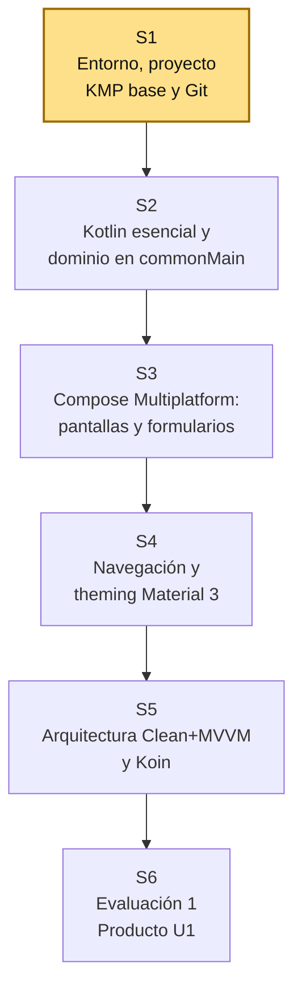
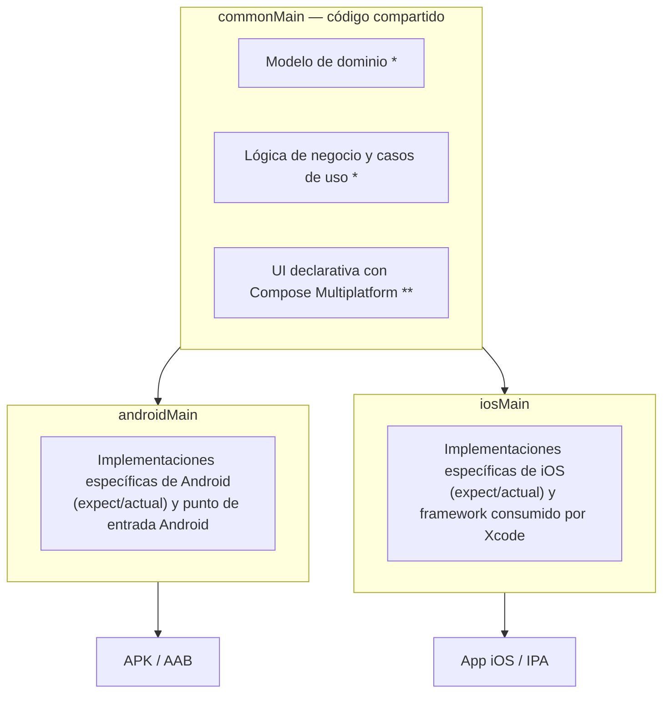

# S1 - Fundamentos de Kotlin Multiplatform: Arquitectura, Entorno y Proyecto Base

## 1. Introducción

Tiempo: 20 min.

### 1.1 Presentación de la sesión

Esta sesión abre la Unidad 1: instala y verifica el entorno de desarrollo multiplataforma (Android Studio, el plugin de Kotlin Multiplatform y, si corresponde, Xcode), crea el proyecto KMP base mediante el asistente oficial y lo versiona en Git. Todavía no se escribe ninguna pantalla propia — es el punto de partida de todo lo que el equipo construirá durante el semestre. El porqué de compartir código entre Android e iOS en vez de mantener dos bases separadas se desarrolla en 1.6, a partir del caso de la lógica que no debería escribirse dos veces.

### 1.2 Índice

1. Desarrollo móvil multiplataforma: el problema que resuelve KMP.
2. Arquitectura de un proyecto Kotlin Multiplatform.
3. Compose Multiplatform: qué es y qué relación tiene con Jetpack Compose.
4. Entorno de desarrollo: Android Studio, plugin de Kotlin Multiplatform y Xcode.
5. El wizard oficial de creación de proyectos y su estructura resultante.
6. Git y control de versiones para el proyecto KMP.

### 1.3 Propósito de aprendizaje

Al concluir la clase, estarás en condiciones de:

- **Configurar** un entorno de desarrollo multiplataforma (Android Studio con el plugin de Kotlin Multiplatform y, en macOS, Xcode) y **crear** un proyecto KMP base mediante el asistente oficial, reconociendo su arquitectura (`commonMain`/`androidMain`/`iosMain`) y dejándolo ejecutable en un emulador Android y versionado en Git.

### 1.4 Producto de sesión

Proyecto KMP base creado con el asistente oficial de Kotlin Multiplatform, ejecutándose sin errores en un emulador Android (y en el simulador de iOS si el estudiante dispone de una Mac), con su estructura de módulos y carpetas (`commonMain`, `androidMain`, `iosMain`) identificada y documentada, versionado en un repositorio Git con el primer commit y publicado en GitHub con los topics académicos del curso.

### 1.5 Metodología

**Tabla 1. Metodología de la sesión**

| Actividades a Realizar en el Periodo | Orientaciones generales (Orientaciones Metodológicas) | Material de estudio recomendado |
|---|---|---|
| Revisión previa individual | Descargar Android Studio (instalador pesado, conviene iniciarlo antes de clase) y leer las secciones 1 y 2 de esta guía. Trabajo individual, antes de clase; no se requiere tener el entorno funcionando todavía, solo la descarga iniciada. | Enlace oficial de descarga de Android Studio, esta guía. |
| Clase presencial | Instalación guiada del plugin de Kotlin Multiplatform, explicación de la arquitectura KMP y creación del proyecto base con el asistente oficial; primera ejecución en el emulador Android. Trabajo individual en la propia laptop, siguiendo al docente paso a paso; consulta inmediata ante errores de instalación, SDK o emulador. | Android Studio con el plugin de Kotlin Multiplatform instalado, asistente de `kmp.jetbrains.com` o el wizard integrado, emulador Android configurado. |
| Evaluación formativa | Verificación en clase de la ejecución del proyecto y del primer commit en Git; inicio de la plantilla de evidencia individual. La evidencia se completa y sustenta de forma individual, fuera del aula, según los criterios mínimos de la sección 4.2. | Plantilla de evidencia individual (4.1), rúbrica de evaluación (5.4). |

### 1.6 Motivación de la sesión

#### 1.6.1 Caso: la lógica que no debería escribirse dos veces

Un equipo construye "PagaTú", una app de pagos entre amigos. En la primera versión solo apuntan a Android: escriben en Kotlin las pantallas, la validación de montos, el cálculo de comisiones y la conexión con el backend. Dos meses después, el docente les pregunta: "¿y los usuarios con iPhone?". La mitad del equipo tiene que empezar de nuevo, esta vez en Swift, reescribiendo la misma validación de montos, el mismo cálculo de comisiones y la misma lógica de conexión — con el riesgo de que un ajuste futuro en las reglas de negocio se corrija en un lado y se olvide en el otro.

```text
¿Qué hubiera cambiado si el equipo decide, antes de escribir la primera
pantalla, que Android e iOS comparten la misma lógica de negocio en Kotlin?
```

**Preguntas de análisis**

**Activación de conocimientos previos**

1. ¿Qué se duplicaría exactamente si el equipo construye la lógica de negocio dos veces (una en Kotlin para Android y otra en Swift para iOS)?
2. ¿Por qué conviene decidir la arquitectura multiplataforma antes de escribir la primera pantalla, y no después de tener ya una app nativa funcionando?

**Comprensión de la arquitectura multiplataforma**

1. ¿Qué parte del proyecto sigue siendo distinta entre Android e iOS aunque se use Kotlin Multiplatform?

### 1.7 Ubicación en el curso

- Unidad: U1 - Fundamentos de Kotlin Multiplatform y UI con Compose Multiplatform.
- Producto de unidad: Aplicación KMP ejecutándose en Android e iOS con navegación completa, theming Material 3 y arquitectura Clean + MVVM con datos simulados.
- Producto del curso: Proyecto Sello — aplicación móvil multiplataforma completa, con arquitectura Clean + MVVM, CRUD REST, autenticación JWT, persistencia local offline-first, builds firmados para Android e iOS y sustentación técnica en ambas plataformas.
- Avance del producto en esta sesión: entorno multiplataforma configurado y proyecto KMP base creado, ejecutable y versionado en Git. Todavía no hay dominio modelado, UI propia, navegación ni arquitectura Clean + MVVM — eso empieza en S2 y se construye progresivamente hasta el cierre de la unidad en S6.

Roadmap del producto de la unidad:

**Figura 1. Roadmap del producto de la Unidad 1 (S1-S6)**



## 2. Explica

Tiempo: 25 min.

### 2.1 Desarrollo móvil multiplataforma: el problema que resuelve KMP

Construir una app "nativa" para Android e iOS de la forma tradicional significa mantener dos proyectos separados: uno en Kotlin/Java sobre Android SDK, otro en Swift sobre UIKit/SwiftUI. Ambos comparten el mismo dominio de negocio (las mismas entidades, las mismas reglas de validación, la misma forma de hablar con el backend), pero ese dominio se escribe, se prueba y se corrige dos veces, en dos lenguajes, por lo general en dos equipos que se desincronizan con el tiempo (ver caso de 1.6.1).

**Kotlin Multiplatform (KMP)**, desarrollado por JetBrains, resuelve esto permitiendo escribir una sola vez el código compartido (modelos de dominio, lógica de negocio, cliente HTTP, persistencia) y compilarlo de forma nativa para cada plataforma: hacia bytecode JVM/Android en el caso de Android, y hacia un framework binario mediante Kotlin/Native en el caso de iOS, consumible directamente desde un proyecto Xcode.

KMP no obliga a compartir también la interfaz de usuario: un equipo puede compartir solo la lógica y mantener la UI 100% nativa por plataforma (Jetpack Compose en Android, SwiftUI en iOS), o compartir además la UI con **Compose Multiplatform** (ver 2.3). El sílabo del curso y el Proyecto Sello de MOV optan por la segunda opción: dominio, lógica de negocio y UI compartidos, ejecutándose en Android e iOS desde una única base de código en `commonMain`.

Esto distingue a KMP de frameworks que abstraen la UI por completo sin exponer las APIs nativas subyacentes (Flutter, React Native): en KMP, cuando una funcionalidad exige código específico de plataforma (una API del sistema, un SDK nativo), el proyecto lo resuelve dentro del propio módulo compartido mediante el mecanismo `expect`/`actual` — mecanismo que el sílabo formaliza recién en la Unidad 2 (S9), no en esta sesión.

### 2.2 Arquitectura de un proyecto Kotlin Multiplatform

Un proyecto KMP organiza el código en **conjuntos de fuentes** (*source sets*) según cuánto código comparten:

**Figura 2. Source sets de un proyecto Kotlin Multiplatform: commonMain, androidMain e iosMain**



<small>*El modelo de dominio y la lógica de negocio en `commonMain` se construyen recién en S2 (Kotlin esencial, colecciones, corrutinas, Flow). **La UI con Compose Multiplatform se practica recién en S3. En S1, `commonMain` existe pero solo contiene el código de plantilla que genera el asistente.</small>

- **`commonMain`**: el código que no depende de ninguna plataforma — modelos, reglas de negocio, y, en este curso, también la UI con Compose Multiplatform. Es el conjunto de fuentes que crece más durante el semestre.
- **`androidMain`** / **`iosMain`**: código específico de cada plataforma — por ejemplo, el punto de entrada de la app (`MainActivity` en Android, `App.swift`/`ContentView.swift` en iOS) y las implementaciones concretas de las capacidades que `commonMain` declara mediante `expect` (fecha/hora del sistema, almacenamiento seguro, cámara, etc. — se trabajan a partir de S9).
- El compilador de Kotlin genera, a partir de `commonMain` + `androidMain`, un artefacto Android normal (APK/AAB); y a partir de `commonMain` + `iosMain`, mediante Kotlin/Native, un framework binario que el proyecto Xcode importa como si fuera una librería nativa más.

**Error frecuente**: escribir código específico de una plataforma directamente en `commonMain` (por ejemplo, una llamada a una API exclusiva de Android). El compilador de `commonMain` no tiene acceso a APIs de plataforma — ese código pertenece a `androidMain` o `iosMain`, o debe expresarse mediante `expect`/`actual`.

### 2.3 Compose Multiplatform: qué es y qué relación tiene con Jetpack Compose

**Jetpack Compose** es el framework declarativo de UI de Google para Android: en vez de manipular vistas imperativamente, se describe la UI como una función del estado (`@Composable`) y el framework decide qué redibujar cuando ese estado cambia.

**Compose Multiplatform**, desarrollado por JetBrains sobre el mismo runtime y compilador de Jetpack Compose, extiende ese mismo modelo declarativo más allá de Android: los mismos `@Composable` escritos en `commonMain` se renderizan de forma nativa en iOS (sobre Skia), en desktop y en la web, sin reescribir la UI por plataforma. JetBrains declaró Compose Multiplatform para iOS estable a mediados de 2024; se mantiene en desarrollo activo, por lo que conviene revisar la documentación oficial (`jetbrains.com/compose-multiplatform`) antes de fijar una versión exacta para el proyecto de equipo.

En S1 el asistente de creación de proyecto ya deja Compose Multiplatform configurado como dependencia, pero **no se escribe ninguna pantalla propia todavía** — eso ocurre desde S3 (composables, estado, modifiers, layouts, formularios).

### 2.4 Entorno de desarrollo: Android Studio, plugin de Kotlin Multiplatform y Xcode

Desarrollar con KMP en este curso requiere, como mínimo:

**Tabla 2. Componentes del entorno de desarrollo requeridos para KMP**

| Componente | Para qué sirve | Obligatorio para |
|---|---|---|
| Android Studio (la versión estable más reciente disponible al momento de instalar) | IDE base: editor, SDK Manager, emulador Android, integración con Gradle. | Android e iOS (el proyecto se edita y compila desde aquí incluso si el target final es iOS). |
| Plugin **Kotlin Multiplatform** (JetBrains Marketplace) | Agrega el asistente de creación de proyectos KMP, resaltado de `expect`/`actual` y utilidades de sincronización con Xcode. | Android e iOS. |
| Plugin de Kotlin embebido, actualizado a su versión más reciente | Evita incompatibilidades entre el compilador de Kotlin y las librerías de Compose Multiplatform. | Android e iOS. |
| Xcode (App Store, solo en macOS) | Compilar y ejecutar la app en el simulador/dispositivo iOS; el framework generado por Kotlin/Native se enlaza aquí. | Solo iOS. |

Notas importantes:

- **Solo se puede compilar y ejecutar el target iOS desde una Mac con Xcode instalado.** No existe forma de emular el simulador de iOS desde Windows o Linux — es una restricción de Apple, no del proyecto ni de Kotlin Multiplatform.
- Quien no tenga acceso a una Mac puede desarrollar y verificar todo el target Android durante el semestre, y debe declararlo como limitación real en la plantilla de evidencia (ver 4.1.4) — el sílabo recién exige dispositivos reales y builds firmados en ambas plataformas en la Unidad 3.
- Antes de usar Xcode por primera vez hay que abrirlo manualmente al menos una vez para aceptar su licencia y dejar que instale componentes adicionales; si no se hace, la compilación del target iOS falla con errores de herramientas faltantes que no tienen relación con el código Kotlin.

### 2.5 El wizard oficial de creación de proyectos y su estructura resultante

JetBrains mantiene dos formas equivalentes de generar un proyecto KMP nuevo, ambas con el mismo resultado:

1. El asistente web **`kmp.jetbrains.com`**, que genera un `.zip` descargable.
2. El asistente integrado en Android Studio (**File → New → New Project → Kotlin Multiplatform**), una vez instalado el plugin de 2.4.

Ambos asistentes preguntan lo mismo: nombre del proyecto, identificador de paquete (`groupId`, estilo `pe.edu.upeu.<proyecto>`), qué plataformas incluir (Android, iOS, y opcionalmente Desktop/Web/Server) y si la UI se comparte con Compose Multiplatform o se mantiene nativa por plataforma. Para este curso, la UI **sí se comparte** (Compose Multiplatform).

JetBrains actualizó en 2026 la estructura de proyecto que generan ambos asistentes: en vez de un único módulo `composeApp` que mezclaba configuración de empaquetado de todas las plataformas, cada plataforma recibe su propio módulo de aplicación con una responsabilidad clara, mientras el código compartido queda en un módulo de librería aparte. En términos generales, lo que verás al abrir el proyecto generado es:

```text
<nombre-del-proyecto>/
├── shared/ (o composeApp/, según la versión del asistente)
│   └── src/
│       ├── commonMain/     # dominio, lógica de negocio y UI Compose compartida
│       ├── androidMain/    # implementaciones expect/actual de Android
│       └── iosMain/        # implementaciones expect/actual de iOS
├── androidApp/             # módulo de aplicación Android (punto de entrada)
├── iosApp/                 # proyecto Xcode que consume el framework compartido
├── gradle/                 # Gradle Wrapper
└── settings.gradle.kts
```

El nombre exacto del módulo de código compartido (`shared` o `composeApp`) puede variar según la versión del asistente que uses — no memorices un nombre fijo: identifica el módulo por lo que contiene (los `commonMain`/`androidMain`/`iosMain` de 2.2), no por su nombre de carpeta.

### 2.6 Git y control de versiones para el proyecto KMP

El proyecto se versiona en Git desde el primer commit, igual que en el resto de sesiones del curso. Dos particularidades de un proyecto KMP frente a un proyecto de un solo lenguaje:

- El `.gitignore` debe excluir artefactos de **dos toolchains distintas**: los de Gradle/Android Studio (`/build/`, `.gradle/`, `local.properties`, `.idea/` salvo lo compartido por el equipo) y, si el equipo trabaja también en Xcode, los propios de Xcode (`DerivedData/`, `xcuserdata/`, `*.xcworkspace/xcuserdata/`).
- `local.properties` (que guarda la ruta local del SDK de Android en cada máquina) **nunca se versiona** — es distinto en la laptop de cada integrante del equipo.

El repositorio del proyecto del curso se crea siguiendo el mismo estándar de topics académicos que usa el Proyecto Sello del curso (`campus-*`, `semestre-2026-2`, `linea-software`, `tipo-ps`, `mov`, `seccion-*`, `grupo-*`) — ver [Guía del Proyecto Sello](../proyecto-sello/index.md#repositorio-académico-y-topics) para el detalle completo del estándar.

## 3. Aplica: actividad práctica guiada

Tiempo: 2h.

**Actividad:** instalación del entorno multiplataforma y creación del proyecto KMP base.

**Propósito de la actividad:** configurar un entorno de desarrollo Kotlin Multiplatform funcional, y generar, ejecutar y versionar en Git el proyecto base sobre el que se construirá la app durante el semestre.

**Orientaciones metodológicas:** el docente guía la instalación del plugin de Kotlin Multiplatform y la creación del proyecto con el asistente oficial, paso a paso frente a la clase; los estudiantes replican cada paso en su propia laptop, verificando la ejecución en el emulador Android (y en el simulador de iOS quienes tengan Mac) antes de versionar el proyecto en Git.

```text
En S1 solo se instala el entorno, se crea el proyecto KMP base con el
asistente oficial y se deja versionado en Git. No se escribe UI propia,
no se modela el dominio y no se aplica arquitectura Clean+MVVM todavía
— eso se construye progresivamente entre S2 y S5.
```

**Actividades para realizar:**

- **3.1** Instalar y verificar Android Studio y el plugin de Kotlin Multiplatform.
- **3.2** (macOS) Instalar y preparar Xcode.
- **3.3** Crear el proyecto KMP base con el asistente oficial.
- **3.4** Reconocer la estructura del proyecto generado.
- **3.5** Ejecutar el proyecto en un emulador Android.
- **3.6** (macOS) Ejecutar el proyecto en el simulador de iOS.
- **3.7** Configurar Git y el primer commit.
- **3.8** Publicar el repositorio en GitHub con los topics académicos.

### 3.1 Instalar y verificar Android Studio y el plugin de Kotlin Multiplatform

**Producto del paso:** entorno de desarrollo con Android Studio y el plugin de Kotlin Multiplatform instalados y verificados.

1. Descarga e instala la versión estable más reciente de Android Studio desde el sitio oficial (`developer.android.com/studio`). No uses versiones *Canary*/*Beta* para el proyecto del curso — solo el canal estable.
2. Abre Android Studio → **Settings/Preferences** (Windows/Linux: `Ctrl+Alt+S`; macOS: `Cmd+,`) → **Plugins** → pestaña **Marketplace**.
3. Busca **"Kotlin Multiplatform"** (publicado por JetBrains) e instálalo.
4. Reinicia Android Studio cuando lo pida.
5. En la misma pantalla de Plugins, ubica **Kotlin** (viene incluido) y actualízalo a su versión más reciente si el IDE ofrece una actualización — evita incompatibilidades entre el compilador y las librerías de Compose Multiplatform.
6. Abre el **SDK Manager** (`Settings → Languages & Frameworks → Android SDK`) y confirma que tienes instalada al menos una versión reciente de la **Android SDK Platform** y el **Android Emulator**.

Verificación esperada:

```text
Settings > Plugins > Installed
✓ Kotlin Multiplatform (JetBrains)
✓ Kotlin — actualizado a la versión más reciente ofrecida por el IDE

Settings > Languages & Frameworks > Android SDK
✓ Al menos una Android SDK Platform instalada
✓ Android Emulator instalado
```

Si el menú **File → New → New Project** no muestra la plantilla **Kotlin Multiplatform**, el plugin no quedó instalado o falta reiniciar el IDE — no continúes al siguiente paso hasta verlo aparecer.

### 3.2 (macOS) Instalar y preparar Xcode

**Producto del paso:** Xcode instalado, abierto al menos una vez y listo para compilar el target iOS.

Este paso aplica solo si tienes una Mac. Si no la tienes, continúa con Android en el resto de la sesión y documenta esta limitación en la plantilla de evidencia (4.1.4) — no bloquea el resto del curso.

1. Instala Xcode desde la Mac App Store.
2. Ábrelo al menos una vez, acepta el acuerdo de licencia y espera a que termine de instalar sus componentes adicionales (herramientas de línea de comandos, plataformas de simulador).
3. Verifica la instalación desde la Terminal:

```bash
xcodebuild -version
xcrun simctl list devicetypes | grep iPhone
```

La primera confirma la versión de Xcode instalada; la segunda confirma que hay al menos un tipo de dispositivo iPhone disponible para el simulador.

### 3.3 Crear el proyecto KMP base con el asistente oficial

**Producto del paso:** proyecto KMP base generado y abierto en Android Studio.

Puedes usar cualquiera de las dos vías descritas en 2.5; se recomienda la integrada en Android Studio porque abre el proyecto directamente al terminar:

1. **File → New → New Project.**
2. Selecciona la plantilla **Kotlin Multiplatform** (aparece en la categoría de plantillas junto a "Phone and Tablet" una vez instalado el plugin de 3.1).
3. Completa los campos del asistente:

**Tabla 3. Campos del asistente de creación de proyecto KMP**

| Campo | Valor para el proyecto del curso |
|---|---|
| Project name | El nombre de tu proyecto, definido por el equipo en el Proyecto Sello (por ejemplo, el dominio elegido). |
| Package name / Project ID | `pe.edu.upeu.<nombre-corto-del-proyecto>`, todo en minúsculas, sin espacios. |
| Location | Una carpeta dedicada fuera de cualquier repositorio de otro curso. |
| Platforms | Android e iOS como mínimo (agrega Desktop solo si tu equipo quiere probarlo también, no es requisito del sílabo). |
| Compartir UI | Deja seleccionada la opción de compartir UI con **Compose Multiplatform** (no elijas "Do not share UI" / UI nativa). |

4. Haz clic en **Finish** y espera a que Android Studio termine de sincronizar Gradle (la primera sincronización descarga dependencias y puede tardar varios minutos).

Si el asistente falla o prefieres generarlo primero fuera del IDE, usa `kmp.jetbrains.com`: completa los mismos campos, descarga el `.zip`, descomprímelo y ábrelo desde Android Studio con **File → Open**.

### 3.4 Reconocer la estructura del proyecto generado

**Producto del paso:** mapa del proyecto generado, con cada carpeta identificada.

Abre el panel de proyecto (vista "Project" o "Android", según prefieras) y localiza:

```text
<tu-proyecto>/
├── shared/ (o composeApp/)
│   └── src/
│       ├── commonMain/kotlin/...
│       ├── androidMain/kotlin/...
│       └── iosMain/kotlin/...
├── androidApp/
├── iosApp/
├── gradle/
├── gradlew
├── gradlew.bat
└── settings.gradle.kts
```

Responde por escrito (queda como parte de tu evidencia técnica, 4.1.3):

1. ¿Qué archivo `.kt` de `commonMain` genera el asistente por defecto? Ábrelo y describe en una línea qué hace.
2. ¿Qué diferencia encuentras entre el contenido de `androidMain` y el de `iosMain`?
3. ¿Dónde está el archivo que declara las plataformas del proyecto (`Android`, `iOS`, etc.) y las dependencias de Compose Multiplatform?

### 3.5 Ejecutar el proyecto en un emulador Android

**Producto del paso:** proyecto corriendo en un emulador Android, sin errores de compilación.

1. Si no tienes un dispositivo virtual, créalo desde **Device Manager** (ícono de celular en la barra lateral) → **Create Device** → elige un perfil de teléfono reciente y una imagen de sistema con Google APIs.
2. En la barra de configuraciones de ejecución, selecciona la configuración de la app Android (por ejemplo `androidApp`) y el emulador creado.
3. Haz clic en **Run** (▶).

Alternativa por línea de comandos, desde la raíz del proyecto (requiere un emulador o dispositivo ya conectado):

```powershell
# Windows
.\gradlew.bat :androidApp:installDebug
```

```bash
# macOS / Linux
./gradlew :androidApp:installDebug
```

El proyecto trae el **Gradle Wrapper** (`gradlew`/`gradlew.bat`): no necesitas instalar Gradle aparte, solo un JDK compatible (el que trae embebido Android Studio es suficiente). Ejecuta siempre el wrapper, nunca un `gradle` instalado aparte, para que todo el equipo use la misma versión.

La app generada por la plantilla no tiene UI propia del curso todavía: muestra una pantalla mínima de ejemplo del asistente. Verlo ejecutar sin errores es el objetivo de este paso — el contenido real llega en S2-S5.

### 3.6 (macOS) Ejecutar el proyecto en el simulador de iOS

**Producto del paso:** proyecto corriendo en el simulador de iOS.

Aplica solo si completaste 3.2. Dos formas equivalentes:

**Desde Android Studio:** selecciona la configuración de ejecución del target iOS (por ejemplo `iosApp`) y un simulador de la lista, luego **Run**. El IDE compila el framework compartido con Kotlin/Native y usa Xcode "por debajo" para levantar el simulador.

**Desde Xcode directamente:** abre el proyecto/workspace dentro de la carpeta `iosApp/` con Xcode, selecciona un simulador de iPhone en la barra superior y presiona el botón de ejecutar (▶).

Si la compilación falla con un error sobre herramientas de línea de comandos o licencias, vuelve a 3.2 — casi siempre significa que Xcode no se abrió y configuró al menos una vez antes de este paso.

### 3.7 Configurar Git y el primer commit

**Producto del paso:** repositorio Git local inicializado, con `.gitignore` correcto y primer commit.

Desde la raíz del proyecto:

```bash
git init
```

Crea (o revisa, si el asistente ya lo generó) un `.gitignore` que incluya al menos:

```text
# Gradle / Android Studio
.gradle/
build/
*/build/
local.properties
.idea/
*.iml

# Xcode (si el equipo también trabaja con el proyecto iOS en Xcode)
iosApp/**/DerivedData/
iosApp/**/xcuserdata/
```

Luego el primer commit:

```bash
git add .
git commit -m "Proyecto KMP base generado con el asistente oficial"
```

Verifica que `local.properties` y las carpetas `build/` **no** quedaron incluidas en el commit:

```bash
git show --stat HEAD
```

### 3.8 Publicar el repositorio en GitHub con los topics académicos

**Producto del paso:** repositorio remoto en GitHub, con topics académicos y el primer commit sincronizado.

1. Crea el repositorio vacío en GitHub (sin `README` ni `.gitignore` generados automáticamente, para no chocar con lo que ya tienes local).
2. Conéctalo y sube el primer commit:

```bash
git remote add origin https://github.com/<org-o-usuario>/<nombre-del-repo>.git
git branch -M main
git push -u origin main
```

3. Agrega los topics académicos mínimos del estándar del curso (ver [Guía del Proyecto Sello, sección 5](../proyecto-sello/index.md#repositorio-académico-y-topics)):

```text
campus-<tu-campus>
semestre-2026-2
linea-software
tipo-ps
mov
seccion-<tu-sección>
grupo-<numero>-<nombre-proyecto>
```

## 4. Crea: actividad autónoma

Tiempo: 2h fuera del aula.

### 4.1 Actividad

Documenta, de forma individual, el entorno multiplataforma configurado y el proyecto KMP base creado en la sesión (ver 1.4): versiones instaladas, comandos de ejecución, estructura de módulos y el primer commit publicado en GitHub.

Completa y evidencia estas tareas:

1. Documentar las versiones instaladas (Android Studio, plugin de Kotlin Multiplatform, Kotlin, y Xcode si aplica).
2. Documentar los comandos usados para ejecutar el proyecto en Android (y en iOS si aplica).
3. Documentar la estructura de carpetas del proyecto generado, identificando `commonMain`, `androidMain` e `iosMain`.
4. Evidenciar el primer commit y el repositorio publicado en GitHub con sus topics.

### 4.2 Propósito

Que cada estudiante demuestre, de forma individual y fuera del aula, que puede reproducir el patrón construido en clase sin el acompañamiento del docente.

En esta sesión eso significa dejar documentado, con evidencia propia, que el entorno multiplataforma y el proyecto KMP base quedaron correctamente instalados, ejecutados y versionados en su propia máquina.

### 4.3 Indicaciones

Entrega un PDF con el siguiente nombre:

```text
S01_MOV_Equipo##_ApellidoNombre.pdf
```

Cada captura de pantalla del informe debe mostrar, sin recortar, el reloj del sistema (fecha y hora) y tu usuario o foto de perfil (Windows, VS Code o navegador) visibles en pantalla — es lo que permite verificar que la evidencia es tuya y que corresponde al momento real de tu trabajo.

#### 4.3.1 Estructura del informe

**Datos del estudiante**

- Nombre:
- Equipo:
- Sesión: S01 - Fundamentos de Kotlin Multiplatform: Arquitectura, Entorno y Proyecto Base
- Rol o aporte realizado:
- Link de GitHub:

**Evidencia técnica**

Incluye capturas o extractos con una breve explicación debajo de cada uno, organizados en los mismos 5 bloques de la rúbrica (4.6):

1. *Comprensión de la arquitectura KMP*
    - Respuestas escritas de 3.4: archivo `.kt` generado por defecto en `commonMain`, diferencias entre `androidMain` e `iosMain`, y ubicación de las dependencias de Compose Multiplatform.
2. *Configuración del entorno*
    - Versiones verificadas del entorno (equivalente a 3.1-3.2): Android Studio, plugin de Kotlin Multiplatform, Kotlin y, si aplica, Xcode.
3. *Creación y ejecución del proyecto*
    - Proyecto ejecutándose en el emulador Android (y en el simulador de iOS si aplica), equivalente a 3.5-3.6.
4. *Estructura del proyecto y Git*
    - Estructura de carpetas del proyecto generado, con `commonMain`, `androidMain` e `iosMain` identificados.
    - Primer commit y repositorio en GitHub con topics visibles, equivalente a 3.7-3.8.
5. *Documentación del entorno y comandos*
    - Comandos usados para ejecutar el proyecto en Android (y en iOS si aplica), documentados de forma reproducible por otra persona.

**Error o hallazgo**

Describe un error o hallazgo real de la instalación o creación del proyecto: una versión incompatible, un paso del asistente que no coincidió con esta guía, un error de compilación al primer intento, o la limitación de no contar con una Mac para el target iOS.

**Reflexión técnica breve**

Responde en 5 a 8 líneas:

```text
¿Qué parte de tu proyecto crees que se beneficiará más de compartir código
entre Android e iOS, y qué parte crees que seguirá necesitando código
específico por plataforma? Justifica con lo que viste en 2.2.
```

### 4.4 Criterios mínimos de aceptación

La evidencia individual se considera completa si:

- El archivo respeta el nombre solicitado.
- Documenta versiones reales del entorno instalado, no genéricas.
- El proyecto compila y se ejecuta al menos en Android.
- Identifica correctamente `commonMain`, `androidMain` e `iosMain` en la estructura del proyecto generado.
- El repositorio existe en GitHub, con el primer commit y los topics académicos mínimos.
- La evidencia está ordenada y sigue la estructura solicitada en 4.3.1.
- Cada captura de la evidencia técnica muestra el reloj del sistema y el usuario/perfil visible, sin recortar.
- Las fechas y horas de las capturas son coherentes con el historial de commits de su repositorio en GitHub.
- Incluye un error o hallazgo técnico diagnosticado.
- Incluye la reflexión técnica breve solicitada.

### 4.5 Preguntas de defensa

1. ¿Qué diferencia hay entre compartir solo lógica de negocio y compartir también la UI con Compose Multiplatform?
2. ¿Qué contiene `commonMain` y qué contienen `androidMain`/`iosMain`?
3. ¿Por qué el target iOS solo puede compilarse desde una Mac con Xcode?
4. ¿Qué evita que `local.properties` se versione en Git?
5. ¿Qué pasaría si el equipo escribiera código específico de Android directamente dentro de `commonMain`?
6. ¿Qué relación tiene Compose Multiplatform con Jetpack Compose?

### 4.6 Rúbrica de evaluación

**Tabla 4. Rúbrica de evaluación**

| Criterio | Peso (%) | A (20 pts) | B (15 pts) | C (10 pts) | D (5 pts) | Nivel obtenido |
|---|---:|---|---|---|---|---:|
| 1. Comprensión de la arquitectura KMP* | 20 | Explica con precisión `commonMain`/`androidMain`/`iosMain` y el problema que resuelve KMP, con evidencia escrita propia. | Explica la arquitectura de forma correcta, con detalles menores imprecisos. | Explicación parcial o imprecisa de la arquitectura. | No explica la arquitectura o la explicación es incorrecta. | |
| 2. Configuración del entorno* | 20 | Entorno instalado y verificado con evidencia real (versiones, plugin, Xcode si aplica). | Entorno configurado con detalles menores faltantes. | Configuración incompleta o sin verificar. | El entorno no está configurado o no hay evidencia. | |
| 3. Creación y ejecución del proyecto* | 20 | Proyecto creado con el asistente oficial y ejecutándose sin errores en Android (e iOS si aplica), con evidencia clara. | Proyecto ejecutándose con detalles menores. | Ejecución parcial o con errores no resueltos. | El proyecto no ejecuta o no hay evidencia. | |
| 4. Estructura del proyecto y Git* | 20 | Estructura identificada con precisión; repositorio con `.gitignore` correcto, primer commit y topics académicos completos. | Estructura y repositorio correctos con detalles menores. | Estructura o repositorio incompletos. | No identifica la estructura ni versiona el proyecto correctamente. | |
| 5. Documentación del entorno y comandos* | 20 | Documentación completa y reproducible por otra persona. | Documentación suficiente, con detalles menores. | Documentación incompleta o poco clara. | No documenta el entorno ni los comandos. | |

\* Agregado manual.

Nota final = suma de (`Peso` / 100 × `Puntos del nivel obtenido`) = ____ / 20.

Para usar la rúbrica con IA, solicita:

```text
Evalúa el PDF usando la rúbrica de la sesión.
Para cada criterio selecciona el nivel obtenido usando la escala A=20, B=15, C=10, D=5 puntos.
Justifica brevemente cada nivel asignado.
Verifica que cada captura muestre reloj del sistema y usuario/perfil visible, y que las fechas sean coherentes con el historial de commits de GitHub. Si falta esta evidencia o hay inconsistencias, indícalo explícitamente antes de calificar.
Calcula la nota final con la fórmula: suma de (Peso/100 × Puntos del nivel obtenido), directamente sobre 20.
Indica 2 fortalezas y 2 recomendaciones.
```

## 5. Cierre

Tiempo: 5 min.

**Resumen breve:** hoy configuraste el entorno multiplataforma (Android Studio, plugin de Kotlin Multiplatform y, si tienes Mac, Xcode), creaste el proyecto KMP base con el asistente oficial, lo ejecutaste en el emulador Android y lo versionaste en Git, publicándolo en GitHub con los topics académicos del curso.

**Dinámica participativa:** cada estudiante comparte en una frase el error o hallazgo más relevante que tuvo durante la instalación o la creación del proyecto (una versión incompatible, un paso del asistente distinto al de esta guía, o la limitación de no tener Mac).

**Metacognición:** ¿qué parte del entorno o del proyecto te costó más configurar hoy, y qué harías distinto la próxima vez?

**Proyección:** en S2 se construye el modelo de dominio y la lógica de negocio en `commonMain` sobre este mismo proyecto base, con Kotlin esencial, colecciones, corrutinas y Flow — lo que hoy es solo la plantilla generada por el asistente empieza a llenarse con el dominio real del Proyecto Sello.

## Bibliografía

- Google. (s.f.). Android Studio. https://developer.android.com/studio
- JetBrains. (s.f.). Kotlin Multiplatform. https://kotlinlang.org/docs/multiplatform.html
- JetBrains. (s.f.). Compose Multiplatform. https://www.jetbrains.com/compose-multiplatform/
- JetBrains. (s.f.). Kotlin Multiplatform Wizard. https://kmp.jetbrains.com
- Apple Inc. (s.f.). Xcode. https://developer.apple.com/xcode/
