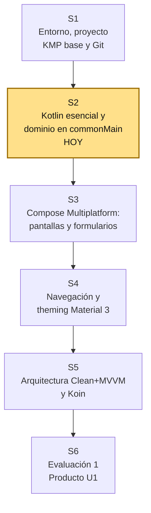
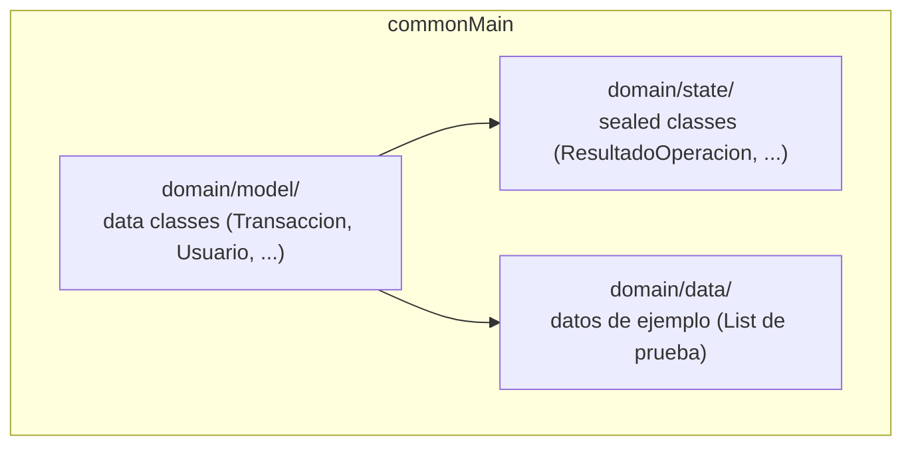

# S2 - Kotlin Esencial y Modelado del Dominio en commonMain

## 1. Introducción

Tiempo: 20 min.

### 1.1 Presentación de la sesión

El proyecto KMP base de S1 tiene `commonMain` casi vacío — solo la plantilla que genera el asistente. Esta sesión lo llena con el primer código propio del Proyecto Sello: los modelos de dominio del equipo, escritos en Kotlin idiomático (null-safety, data classes, sealed classes, colecciones) y, cuando el dominio lo requiere, con corrutinas y Flow. Todavía no hay UI ni arquitectura Clean + MVVM — eso empieza en S3 y S5, sobre el dominio que se modela hoy.

### 1.2 Índice

1. Null-safety en Kotlin: por qué importa en un dominio compartido.
2. Data classes: modelar entidades del dominio.
3. Sealed classes: modelar estados y variantes cerradas.
4. Colecciones en Kotlin: transformar datos del dominio.
5. Corrutinas y Flow: una primera mirada, sin bloquear la UI.
6. Dónde vive el dominio dentro de `commonMain`.

### 1.3 Propósito de aprendizaje

Al concluir la clase, estarás en condiciones de:

- **Modelar** el dominio del Proyecto Sello en `commonMain` usando data classes y sealed classes de Kotlin, aplicando null-safety y operaciones de colecciones, y reconociendo cuándo una operación del dominio requiere una corrutina.

### 1.4 Producto de sesión

Modelos de dominio (data classes) y estados (sealed classes) del Proyecto Sello, escritos en `commonMain` con Kotlin idiomático, con al menos una función de colecciones aplicada sobre datos de ejemplo del dominio, versionados en Git.

### 1.5 Metodología

**Tabla 1. Metodología de la sesión**

| Actividades a Realizar en el Periodo | Orientaciones generales (Orientaciones Metodológicas) | Material de estudio recomendado |
|---|---|---|
| Revisión previa individual | Revisar el proyecto KMP base de S1 y confirmar que ejecuta sin errores. Trabajo individual, antes de clase; traer identificadas las entidades principales del dominio del equipo (por ejemplo, para PagaTú: usuario, transacción, grupo). | Proyecto de S1, evidencia individual de S1. |
| Clase presencial | Explicación guiada de null-safety, data classes, sealed classes y colecciones; modelado guiado del dominio de PagaTú en `commonMain`, replicado por cada equipo sobre su propio dominio. Trabajo individual en la propia laptop, siguiendo al docente paso a paso; consulta inmediata ante errores de compilación. | Pasos 3.1 a 3.6 de esta guía. |
| Evaluación formativa | Verificación en clase de que los modelos compilan en `commonMain` y de que no hay código específico de plataforma filtrado ahí. La evidencia se completa y sustenta de forma individual, fuera del aula, según los criterios mínimos de la sección 4.4. | Indicaciones de entrega (4.3), rúbrica de evaluación (4.6). |

### 1.6 Motivación de la sesión

#### 1.6.1 Caso: el modelo que permitía un monto imposible

El mismo equipo de PagaTú (caso de S1) ya tiene el proyecto KMP corriendo, pero todavía no ha escrito ningún modelo propio. Alguien propone la primera versión de una transacción:

```kotlin
class Transaccion(var monto: Double, var descripcion: String?)
```

Al probarla, otro integrante crea una transacción con `monto = -50.0` y el código la acepta sin quejarse — nada impide un monto negativo. Otro intenta imprimir `descripcion` sin verificar si es null, y la app se cae en tiempo de ejecución en Android (donde un `null` inesperado sí compila) mientras que en Kotlin puro el compilador debería haberlo detectado antes. El problema no es el lenguaje: es que la clase no usó las herramientas que Kotlin ya ofrece para que estos dos errores sean imposibles de compilar, no solo improbables en tiempo de ejecución.

```text
¿Qué cambiaría si el modelo declarara explícitamente qué campos pueden
ser null y qué campos no, y si validara sus propias reglas al crearse?
```

**Preguntas de análisis**

**Activación de conocimientos previos**

1. ¿Qué diferencia hay entre un error que el compilador detecta y uno que solo aparece al ejecutar la app?
2. ¿Por qué declarar un campo como no-nulable (`String` en vez de `String?`) cambia lo que el compilador exige en el resto del código?

**Comprensión del modelado del dominio**

1. ¿Qué ventaja tiene una `data class` frente a una `class` común para representar una entidad del dominio?
2. ¿En qué se diferencia modelar un conjunto cerrado de estados (por ejemplo, éxito/error/cargando) con una `sealed class` frente a usar un `Boolean` o un `String` para lo mismo?

### 1.7 Ubicación en el curso

- Unidad: U1 - Fundamentos de Kotlin Multiplatform y UI con Compose Multiplatform.
- Producto de unidad: Aplicación KMP ejecutándose en Android e iOS con navegación completa, theming Material 3 y arquitectura Clean + MVVM con datos simulados.
- Producto del curso: Proyecto Sello — aplicación móvil multiplataforma completa, con arquitectura Clean + MVVM, CRUD REST, autenticación JWT, persistencia local offline-first, builds firmados para Android e iOS y sustentación técnica en ambas plataformas.
- Avance del producto en esta sesión: modelos de dominio y estados del Proyecto Sello escritos en `commonMain`, con Kotlin idiomático. Todavía no hay UI propia ni arquitectura Clean + MVVM — eso empieza en S3 y S5.

**Figura 1. Roadmap del producto de la Unidad 1 (S1-S6)**



## 2. Explica

Tiempo: 25 min.

### 2.1 Null-safety en Kotlin: por qué importa en un dominio compartido

Kotlin distingue en el sistema de tipos entre un tipo que **puede** ser null (`String?`) y uno que **no puede** (`String`). Si una variable es `String`, el compilador garantiza que nunca contendrá `null` — cualquier intento de asignarle `null`, o de recibir un valor potencialmente nulo sin verificarlo, es un error de compilación, no un error que aparece recién al ejecutar la app.

Esto importa especialmente en `commonMain`: el mismo modelo se usa desde Android y desde iOS, y un error de null que hoy solo se detecta en tiempo de ejecución en una plataforma podría comportarse distinto en la otra. Declarar bien la nulabilidad en el dominio compartido evita que ese comportamiento diverja entre plataformas.

**Tabla 2. Operadores de null-safety más usados**

| Operador | Qué hace | Ejemplo |
|---|---|---|
| `?` | Declara que el tipo puede ser null. | `var descripcion: String?` |
| `?.` (safe call) | Ejecuta la operación solo si el valor no es null; si es null, devuelve null. | `descripcion?.length` |
| `?:` (elvis) | Da un valor por defecto cuando la expresión de la izquierda es null. | `descripcion ?: "Sin descripción"` |
| `!!` (not-null assertion) | Fuerza el tipo a no-nulable; lanza excepción si en realidad es null. | `descripcion!!.length` |

**Error frecuente**: usar `!!` para "silenciar" un error de compilación sin pensar si el valor realmente puede ser null en ese punto. `!!` traslada el error de tiempo de compilación a tiempo de ejecución — exactamente lo que null-safety busca evitar. En el dominio de este curso, `!!` debe ser la excepción, no el hábito.

### 2.2 Data classes: modelar entidades del dominio

Una **`data class`** es la forma idiomática de modelar una entidad del dominio en Kotlin: el compilador genera automáticamente `equals()`, `hashCode()`, `toString()` y una función `copy()`, a partir de las propiedades declaradas en el constructor.

```kotlin
data class Transaccion(
    val id: String,
    val monto: Double,
    val descripcion: String? = null,
    val fecha: kotlinx.datetime.LocalDate
)
```

Frente a la clase del caso de 1.6.1, esta versión ya declara explícitamente qué campos son nulables (`descripcion`) y cuáles no (`monto`, `fecha`), y usa `val` en vez de `var` — las entidades del dominio son inmutables por defecto: un cambio se representa creando una copia nueva con `copy()`, no mutando la instancia original.

```kotlin
val transaccionCorregida = transaccion.copy(monto = 75.0)
```

**Error frecuente**: usar `var` en las propiedades de una `data class` del dominio "por si acaso hay que cambiarlas después". Esto abre la puerta a que cualquier parte del código mute el estado sin control. La inmutabilidad (`val` + `copy()`) es la que hace que un modelo de dominio compartido sea seguro de pasar entre `commonMain`, la UI y, más adelante, entre corrutinas concurrentes.

### 2.3 Sealed classes: modelar estados y variantes cerradas

Una **`sealed class`** (o `sealed interface`) declara un conjunto **cerrado** de subtipos posibles, conocidos en tiempo de compilación. A diferencia de un `enum`, cada variante puede llevar sus propios datos.

```kotlin
sealed class ResultadoOperacion {
    data class Exito(val transaccion: Transaccion) : ResultadoOperacion()
    data class Error(val mensaje: String) : ResultadoOperacion()
    object Cargando : ResultadoOperacion()
}
```

La ventaja frente a un `Boolean` o un `String` para representar el mismo estado aparece al usar `when`: el compilador **obliga** a cubrir todas las variantes (o exige una rama `else`), de modo que si en el futuro se agrega una nueva variante (por ejemplo `SinConexion`), el compilador señala en rojo cada `when` que quedó incompleto — un error de compilación, no un caso olvidado que solo se descubre en producción.

```kotlin
fun mensajeParaUsuario(resultado: ResultadoOperacion): String = when (resultado) {
    is ResultadoOperacion.Exito -> "Transacción registrada: ${resultado.transaccion.monto}"
    is ResultadoOperacion.Error -> "Error: ${resultado.mensaje}"
    ResultadoOperacion.Cargando -> "Procesando..."
}
```

Este patrón (`Exito`/`Error`/`Cargando`) es exactamente el que usará el `UiState` de la arquitectura Clean + MVVM desde S5 — hoy se practica sobre datos simulados, sin ViewModel todavía.

### 2.4 Colecciones en Kotlin: transformar datos del dominio

Kotlin ofrece funciones de colecciones que evitan bucles manuales para las transformaciones más comunes sobre listas del dominio:

**Tabla 3. Funciones de colecciones más usadas sobre el dominio**

| Función | Qué hace | Ejemplo |
|---|---|---|
| `filter` | Devuelve los elementos que cumplen una condición. | `transacciones.filter { it.monto > 0 }` |
| `map` | Transforma cada elemento en otro valor. | `transacciones.map { it.monto }` |
| `sumOf` | Suma un valor numérico extraído de cada elemento. | `transacciones.sumOf { it.monto }` |
| `groupBy` | Agrupa los elementos según una clave. | `transacciones.groupBy { it.fecha }` |
| `sortedByDescending` | Ordena de mayor a menor según un criterio. | `transacciones.sortedByDescending { it.fecha }` |

Estas funciones son **inmutables**: ninguna modifica la lista original, todas devuelven una lista nueva — coherente con la inmutabilidad de las `data class` de 2.2.

### 2.5 Corrutinas y Flow: una primera mirada, sin bloquear la UI

Una operación del dominio que toma tiempo (leer una base de datos local, esperar una respuesta de red) no debe bloquear el hilo principal, porque congelaría la UI. Kotlin resuelve esto con **corrutinas**: funciones marcadas `suspend` que pueden pausarse y reanudarse sin bloquear el hilo que las llama.

```kotlin
suspend fun calcularResumenMensual(transacciones: List<Transaccion>): Double {
    return transacciones.sumOf { it.monto }
}
```

Cuando una operación no produce un único valor sino una **secuencia de valores en el tiempo** (por ejemplo, el saldo actualizándose cada vez que se agrega una transacción), se usa **`Flow`** en vez de una función `suspend` simple:

```kotlin
fun observarSaldo(transacciones: List<Transaccion>): kotlinx.coroutines.flow.Flow<Double> =
    kotlinx.coroutines.flow.flow {
        emit(transacciones.sumOf { it.monto })
    }
```

En esta sesión corrutinas y `Flow` se presentan solo como concepto y se practican con ejemplos simulados en `commonMain` — su uso real conectado a un `ViewModel` (`StateFlow`, `UiState`) llega recién en S5, y su conexión con una API real, en S7-S8.

**Error frecuente**: marcar una función como `suspend` sin que en realidad haga ninguna operación que deba pausarse. `suspend` no es un adorno — se usa cuando la función realiza trabajo potencialmente largo (red, disco, espera).

### 2.6 Dónde vive el dominio dentro de commonMain

Con los modelos y funciones de 2.1-2.5 ya es posible organizar `commonMain` con las primeras carpetas propias del dominio, sin todavía tocar `androidMain` ni `iosMain`:

**Figura 2. Ubicación del dominio dentro de commonMain**



Todavía no existe un paquete `viewmodel/` ni `repository/` — esos aparecen recién en S5, cuando el dominio de hoy se conecta a la arquitectura Clean + MVVM.

## 3. Aplica: actividad práctica guiada

Tiempo: 2h.

**Actividad:** modelado del dominio del Proyecto Sello en `commonMain`, usando data classes, sealed classes, colecciones y una primera función `suspend`.

**Propósito de la actividad:** que cada equipo traduzca las entidades de su propio dominio (identificadas antes de clase, ver 1.5) a Kotlin idiomático, con null-safety aplicada correctamente y sin código específico de plataforma filtrado en `commonMain`.

**Orientaciones metodológicas:** el docente modela en vivo el dominio de PagaTú (Usuario, Transaccion, ResultadoOperacion), paso a paso; cada equipo replica el mismo patrón sobre su propio dominio, verificando en cada paso que el código compile únicamente dentro de `commonMain`, sin depender de ninguna API de Android o iOS.

```text
En S2 solo se modela el dominio en Kotlin puro dentro de commonMain,
con datos de ejemplo escritos a mano en el propio código. No hay UI,
no hay ViewModel y no hay conexión a ninguna API real todavía — eso
se construye progresivamente entre S3 y S8.
```

**Actividades para realizar:**

- **3.1** Identificar las entidades principales del dominio propio.
- **3.2** Modelar las entidades con data classes y null-safety.
- **3.3** Modelar un estado de operación con una sealed class.
- **3.4** Crear datos de ejemplo y aplicar funciones de colecciones.
- **3.5** Escribir una función `suspend` sobre el dominio.
- **3.6** Organizar el paquete `domain/` dentro de `commonMain` y versionar en Git.

### 3.1 Identificar las entidades principales del dominio propio

**Producto del paso:** lista de 2 a 4 entidades del dominio del equipo, con sus atributos principales.

Completa, para tu propio proyecto:

```text
Entidad 1: ______  — atributos: ______
Entidad 2: ______  — atributos: ______
```

### 3.2 Modelar las entidades con data classes y null-safety

**Producto del paso:** al menos dos `data class` en `commonMain`, con nulabilidad declarada correctamente en cada atributo.

Dentro de `shared/src/commonMain/kotlin/<paquete>/domain/model/`, crea un archivo por entidad, siguiendo el patrón de 2.2. Para cada atributo, decide explícitamente si debe ser nulable (`?`) o no, y justifica por qué.

### 3.3 Modelar un estado de operación con una sealed class

**Producto del paso:** una `sealed class` con al menos tres variantes (éxito, error, cargando o equivalentes propias del dominio).

Ubícala en `domain/state/`, siguiendo el patrón de 2.3. Escribe una función con `when` que cubra todas las variantes sin usar `else`.

### 3.4 Crear datos de ejemplo y aplicar funciones de colecciones

**Producto del paso:** una lista de ejemplo del dominio propio, con al menos dos transformaciones de colecciones aplicadas (2.4).

```kotlin
val datosEjemplo: List<TuEntidad> = listOf(
    // al menos 4 elementos de ejemplo
)
```

Aplica al menos dos de: `filter`, `map`, `sumOf`, `groupBy`, `sortedByDescending`, sobre `datosEjemplo`.

### 3.5 Escribir una función suspend sobre el dominio

**Producto del paso:** una función `suspend` que procese el dominio propio, siguiendo el patrón de 2.5.

Justifica por escrito (queda como evidencia técnica, 4.1.3): ¿por qué esta operación específica se beneficia de ser `suspend`?

### 3.6 Organizar el paquete domain/ dentro de commonMain y versionar en Git

**Producto del paso:** paquete `domain/` estructurado y commit registrado.

```text
commonMain/kotlin/<paquete>/domain/
├── model/      # data classes
├── state/      # sealed classes
└── data/       # datos de ejemplo
```

```bash
git add .
git commit -m "Modelar dominio del Proyecto Sello en commonMain"
```

Verifica que el proyecto siga compilando y ejecutándose en Android tras el cambio (mismo comando de S1, 3.5).

## 4. Crea: actividad autónoma

Tiempo: 2h fuera del aula.

### 4.1 Actividad

Cada estudiante consolida, de forma individual y fuera del aula, el modelado del dominio propio construido en clase, ampliándolo con al menos una entidad adicional.

Completa y evidencia estas tareas:

1. Modelar al menos tres entidades del dominio con data classes y null-safety justificada.
2. Modelar al menos un estado de operación con una sealed class y una función `when` exhaustiva.
3. Aplicar al menos tres funciones distintas de colecciones sobre datos de ejemplo del dominio.
4. Escribir al menos una función `suspend` justificada.
5. Confirmar que el proyecto compila y ejecuta sin errores tras los cambios, y versionar el avance en Git.

### 4.2 Propósito

Que cada estudiante demuestre, de forma individual y fuera del aula, que puede reproducir el patrón construido en clase sin el acompañamiento del docente, aplicándolo sobre una porción más amplia del dominio propio del equipo.

### 4.3 Indicaciones

Entrega un PDF con el siguiente nombre:

```text
S02_MOV_Equipo##_ApellidoNombre.pdf
```

Cada captura de pantalla del informe debe mostrar, sin recortar, el reloj del sistema (fecha y hora) y tu usuario o foto de perfil (Windows, VS Code o navegador) visibles en pantalla — es lo que permite verificar que la evidencia es tuya y que corresponde al momento real de tu trabajo.

#### 4.3.1 Estructura del informe

**Datos del estudiante**

- Nombre:
- Equipo:
- Sesión: S02 - Kotlin Esencial y Modelado del Dominio en commonMain
- Rol o aporte realizado:
- Link de GitHub:

**Evidencia técnica**

Incluye capturas o extractos con una breve explicación debajo de cada uno, organizados en los mismos 4 bloques de la rúbrica (4.6):

1. *Data classes y null-safety*
    - Código de las entidades modeladas, con la justificación de nulabilidad de 3.2.
2. *Sealed class y estados*
    - Código de la sealed class y de la función `when` exhaustiva de 3.3.
3. *Colecciones*
    - Código con las funciones de colecciones aplicadas sobre los datos de ejemplo de 3.4.
4. *Corrutinas y Git*
    - Código de la función `suspend` con su justificación (3.5).
    - Evidencia del commit y de que el proyecto sigue ejecutándose (3.6).

**Error o hallazgo**

Describe un error real de compilación relacionado con null-safety, o una variante de la sealed class que olvidaste cubrir en un `when` y que el compilador señaló.

**Reflexión técnica breve**

Responde en 5 a 8 líneas:

```text
¿Qué entidad de tu dominio te costó más decidir qué atributos debían
ser nulables? ¿Cómo lo resolviste, y qué hubiera pasado si los hubieras
declarado todos como no-nulables por defecto?
```

### 4.4 Criterios mínimos de aceptación

La evidencia individual se considera completa si:

- Cada data class usa `val` y declara la nulabilidad de cada atributo de forma justificada, no por defecto.
- La sealed class tiene al menos tres variantes y una función `when` que las cubre todas.
- Se aplican al menos tres funciones distintas de colecciones sobre datos de ejemplo reales del dominio.
- Existe al menos una función `suspend` justificada por escrito.
- El código vive únicamente en `commonMain`, sin dependencias de APIs de Android o iOS.
- El proyecto compila y ejecuta sin errores tras los cambios, con el avance versionado en Git.
- Cada captura de la evidencia técnica muestra el reloj del sistema y el usuario/perfil visible, sin recortar.
- Las fechas y horas de las capturas son coherentes con el historial de commits de su repositorio en GitHub.
- Incluye un error o hallazgo técnico diagnosticado.
- Incluye la reflexión técnica breve solicitada.

### 4.5 Preguntas de defensa

1. ¿Por qué tus data classes usan `val` en vez de `var`?
2. ¿Qué pasaría si agregaras una nueva variante a tu sealed class sin actualizar los `when` existentes?
3. ¿Por qué elegiste declarar ese atributo específico como nulable?
4. ¿Qué diferencia hay entre `map` y `filter` en las funciones que aplicaste?
5. ¿Por qué tu función `suspend` necesita serlo, y qué pasaría si no lo fuera?

### 4.6 Rúbrica de evaluación

**Tabla 4. Rúbrica de evaluación**

| Criterio | Peso (%) | A (20 pts) | B (15 pts) | C (10 pts) | D (5 pts) | Nivel obtenido |
|---|---:|---|---|---|---|---:|
| 1. Data classes y null-safety* | 25 | Data classes inmutables, con nulabilidad justificada en cada atributo. | Data classes correctas, con justificación parcial. | Data classes presentes con nulabilidad poco justificada. | No presenta data classes válidas. | |
| 2. Sealed class y estados* | 25 | Sealed class con variantes claras y `when` exhaustivo sin `else`. | Sealed class correcta con `when` parcialmente exhaustivo. | Sealed class incompleta o mal aplicada. | No presenta sealed class. | |
| 3. Colecciones* | 25 | Al menos tres funciones de colecciones aplicadas correctamente sobre datos reales del dominio. | Dos funciones aplicadas correctamente. | Una función aplicada o con errores. | No aplica funciones de colecciones. | |
| 4. Corrutinas y Git* | 25 | Función `suspend` bien justificada; commit claro con proyecto ejecutando sin errores. | Función `suspend` presente, justificación básica; commit presente. | Función `suspend` sin justificación clara o commit incompleto. | No presenta función `suspend` ni evidencia de Git. | |

\* Agregado manual.

Nota final = suma de (`Peso` / 100 × `Puntos del nivel obtenido`) = ____ / 20.

Para usar la rúbrica con IA, solicita:

```text
Evalúa el PDF usando la rúbrica de la sesión.
Para cada criterio selecciona el nivel obtenido usando la escala A=20, B=15, C=10, D=5 puntos.
Justifica brevemente cada nivel asignado.
Verifica que cada captura muestre reloj del sistema y usuario/perfil visible, y que las fechas sean coherentes con el historial de commits de GitHub. Si falta esta evidencia o hay inconsistencias, indícalo explícitamente antes de calificar.
Calcula la nota final con la fórmula: suma de (Peso/100 × Puntos del nivel obtenido), directamente sobre 20.
Indica 2 fortalezas y 2 recomendaciones.
```

## 5. Cierre

Tiempo: 5 min.

**Resumen breve:** hoy `commonMain` dejó de estar casi vacío: el dominio del Proyecto Sello quedó modelado con data classes inmutables, null-safety explícita, una sealed class de estados y las primeras funciones de colecciones y corrutinas, todo verificado sin código específico de plataforma.

**Dinámica participativa:** cada estudiante comparte en una frase qué atributo de su dominio fue más difícil de decidir como nulable o no-nulable, y por qué.

**Metacognición:** ¿qué diferencia notas entre pensar el dominio en Kotlin con null-safety y sealed classes, frente a cómo lo hubieras modelado sin esas herramientas?

**Proyección:** en S3 este mismo dominio empieza a mostrarse en pantalla: composables, estado y formularios con Compose Multiplatform, construidos sobre los modelos y estados definidos hoy.

## Bibliografía

- JetBrains. (s.f.). Kotlin null safety. https://kotlinlang.org/docs/null-safety.html
- JetBrains. (s.f.). Data classes. https://kotlinlang.org/docs/data-classes.html
- JetBrains. (s.f.). Sealed classes and interfaces. https://kotlinlang.org/docs/sealed-classes.html
- JetBrains. (s.f.). Coroutines guide. https://kotlinlang.org/docs/coroutines-guide.html
- JetBrains. (s.f.). Asynchronous Flow. https://kotlinlang.org/docs/flow.html
